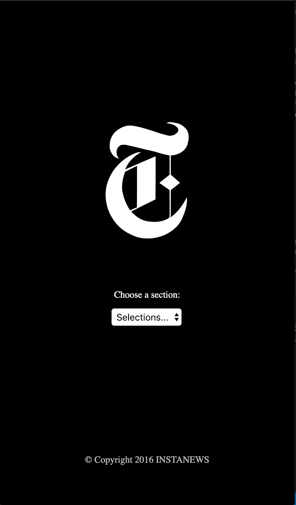

A responsive news app that features top categorized stories, published by the New York Times, and accessed through an api. The data is updated asynchronously by using ajax. The site uses sass for style, and HTML is used for the markup. JQuery is used to setup the ajax get requests.

This repo can be found at : https://github.com/jinjin62/Instanews

To setup on your device, download from repo and run gulp in the file.

Get your own API key from the New York Times:
https://developer.nytimes.com/

Front page, taken from a mobile perspective.

View of the site beyond the front page in desktop format.

